# SchoolBus

## 引言

> 所涉及的技术包含：
>
> - 后端：
>   - Springboot
>   - MyBatisPlus（可自定义sql语句）
>   - Dubbo（负载均衡，异步调用，结果缓存，分组聚合）
>   - Mysql
>   - Redis(监听key过期->发布订阅模式)
>   - RocketMQ
>   - Swagger2
>   - Validated
>   - Druid监测
>   - Spring定时器
>   - Hystrix熔断降级
>   - 持续补充...
> - 前端：
>   - vue
>   - vuex
>   - vue-router
>   - axios
>   - vant-ui
>   - 持续补充...

##访问入口

- [前端源码]()
- [网站测试访问](http://ot.dreamcat.ink:8080/) 只供测试学习使用哈，别搞崩了哇...**提醒：面向移动端**

## 架构图

### 架构思考

- [团队开会文档记录](./doc/meeting.md)**记录一些开会讨论的事情以及接下来要做的计划**
- [数据模型建立记录](./doc/sql.md) 逐渐建立数据库模型
- **我也是第一次做这样的项目，没有什么经验，希望大家提供一些建议和经验，我也在这条坎坷的路上不断的去尝试和总结。希望大家多多支持，🙏**
- **注意**:由于学生，没有能力买好一点的服务器，因此采用内网穿透技术将本地服务映射个人的阿里云。
- 根据本校小程序的页面：[pages](https://www.processon.com/view/link/5e4eb17ae4b0e415c2756fd5)，由于疫情期间，下单模块的页面暂时无法分析。日后会补充...
- 根据仅有的页面：**班车预约主页**、**车次列表页面**、**我的车票页面**、**用户登陆注册修改页面**和待定的**订单和下单页面**
- 暂时采用的[架构技术图](https://www.processon.com/view/link/5e4eb5cde4b0a802afb2787c)，后续会改善其中的所采用的技术，并且会针对每一个所涉及的技术的**使用场景**。
- 后端环境搭建，暂时没有采用分布式，数据库忽略，后续补充。[后端搭建](https://www.processon.com/view/link/5e4f7c6ce4b0d4dc87667203)
- 后端部分启动测试，包括Zookeeper、Dubbo、Tomcat、RocketMQ、RocketMQ-Console等[启动图及命令](https://www.processon.com/view/link/5e500788e4b0cc44b5a570eb)
  - [全网最全frp内网穿透(ssh及web)](https://github.com/DreamCats/JavaBooks/blob/master/Tools/frp/全网最全frp内网穿透(ssh及web).md)
  - [centos7安装dubbo环境](https://github.com/DreamCats/JavaBooks/blob/master/Tools/dubbo/centos7安装dubbo环境.md)
  - [centos7安装rocketmq环境及配置](https://github.com/DreamCats/JavaBooks/blob/master/Tools/rocketmq/centos7安装rocketmq及配置.md)
- 为了快速搭建项目考虑采用[guns](https://gitee.com/stylefeng/guns.git)框架进行二次开发。从而将一些中间件集成进去。
- 2.24根据讨论，绝对项目中采用哪些服务.[架构图](https://www.processon.com/view/link/5e52a6e3e4b0c037b5fb1f2f)

#### 技术选型

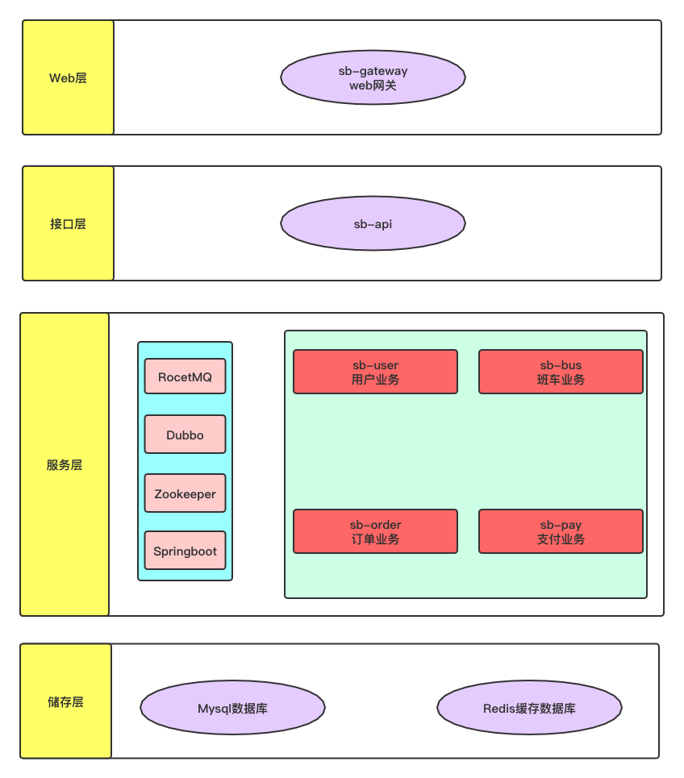

## 环境搭建

### 后端环境端口

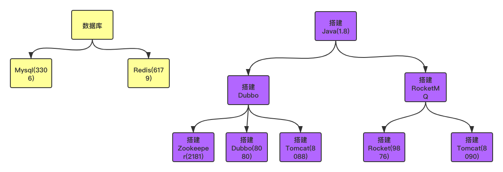

### 环境启动

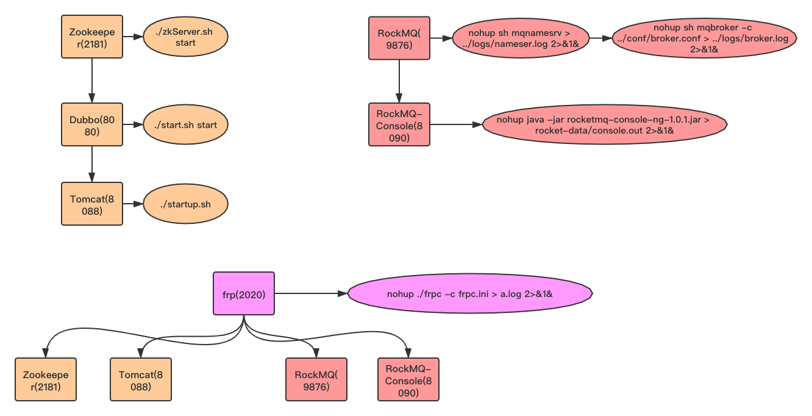

### guns

**注意：在guns基础进行快速开发，使用guns的版本是：[4.2](https://gitee.com/stylefeng/guns/tree/v4.2/)**

- 我们使用的rest风格，因此上述项目中的admin和generator没有用上。
- 创建数据库，sql在你rest的db文件中
- 直接复制其项目中的rest和core就可以了，修改rest中的数据源，启动即可。
- 访问`http://localhost:8080/auth?userName=admin&password=admin`，即可看到jwt的信息了

### 调试工具

- [postwoman](https://postwoman.io/) 采用这个，没必要下载多余的插件
- [postman](谷歌插件有) 谷歌插件有，翻墙即可

### 生成db模型

- guns-rest的test目录下有生成数据库模型代码，注意输出目录的包名即可
- 安装idea的easycode插件

## 一些文档

- [sql文档](./doc/sql.md)
- [api文档](./doc/api.md)：**最后采用swagger**
- [会议文档](./doc/meeting.md)

## 模块

- 用户模块
- 班车模块
- 订单模块
- 支付模块

### 服务端口

| 服务名称 | 端口 |
| :------: | :--: |
| 用户服务 | 8081 |
| 班车服务 | 8082 |
| 订单服务 | 8083 |
| 支付服务 | 8084 |

### Gateway

| 服务名称 | 端口 |
| :------: | :--: |
| GateWay  | 8087 |

### Dubbo端口

| 服务名称 | 端口  |
| :------: | :---: |
| 用户服务 | 20881 |
| 班车服务 | 20882 |
| 订单服务 | 20883 |
| 支付服务 | 20884 |

### 文档树

```shell
.
├── doc
├── imgs
└── school-bus
    ├── guns-api
    ├── guns-bus
    ├── guns-core
    ├── guns-gateway
    ├── guns-order
    ├── guns-pay
    └── guns-user
```

- **doc**:**记录一些文档，如会议文档等**
- **imgs**:**存放写文档的图片，方便渲染**
- **guns-api**: **存放业务逻辑服务的相关接口，以及各种Dto实体等。**
- **guns-core**: **存放一些工具类，一些公共配置文件以及常量文件等。**
- **guns-bus**: **存放班车和场次相关的model，mapper，service等文件。**
- **guns-order**: **存放订单相关的model，mapper，service等文件。**
- **guns-pay**: **存放支付相关的model，mapper，service等文件。**
- **guns-user**: **存放用户相关的model，mapper，service等文件。**

### 前端页面

#### 用户注册

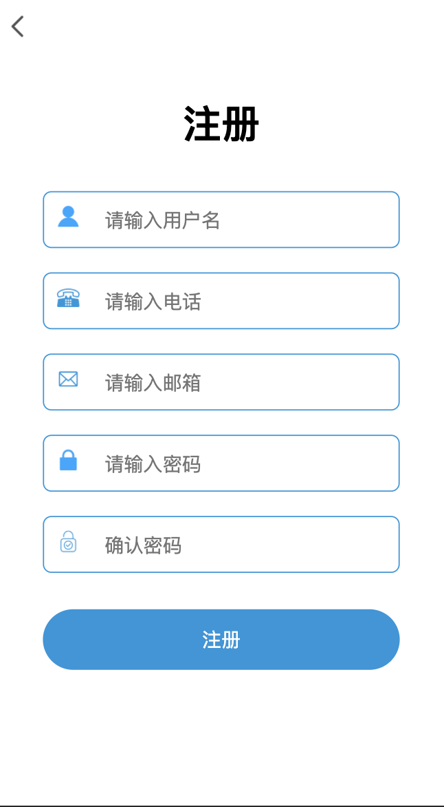

#### 用户登录

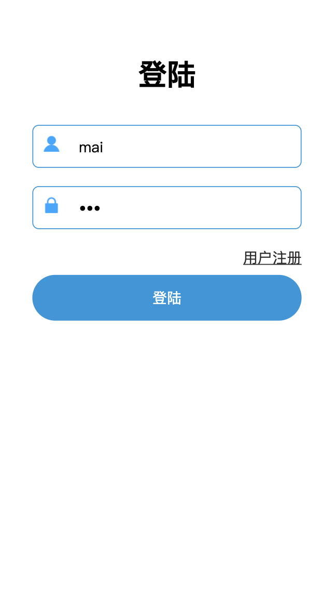

#### 个人中心

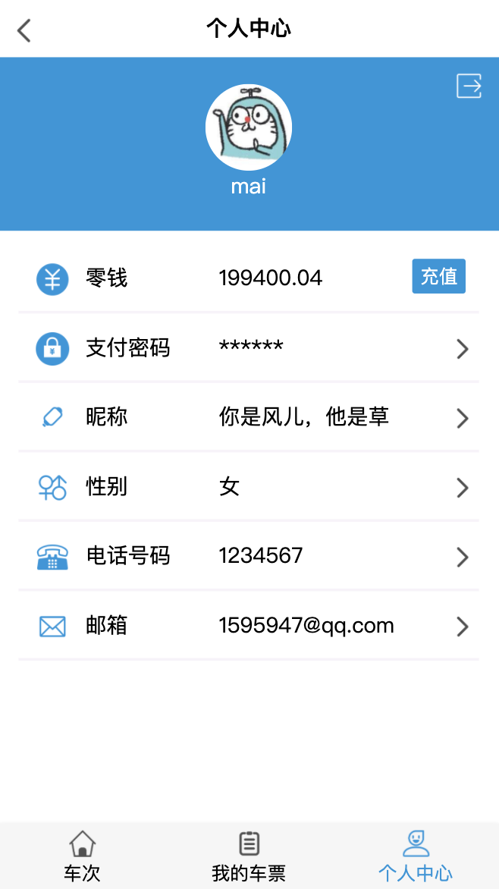

#### 车次列表

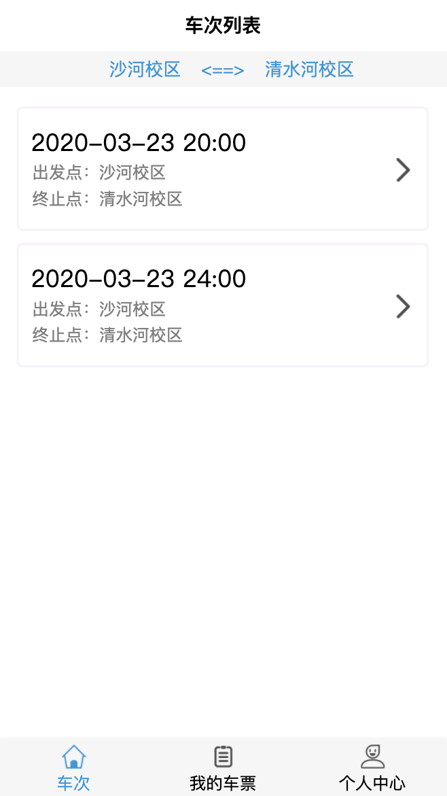

#### 车次信息

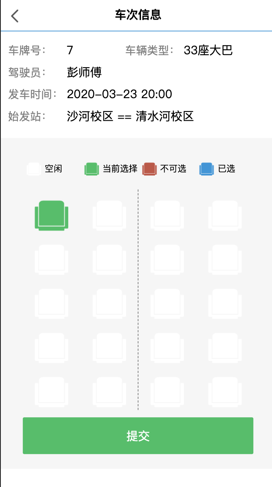

#### 确认订单

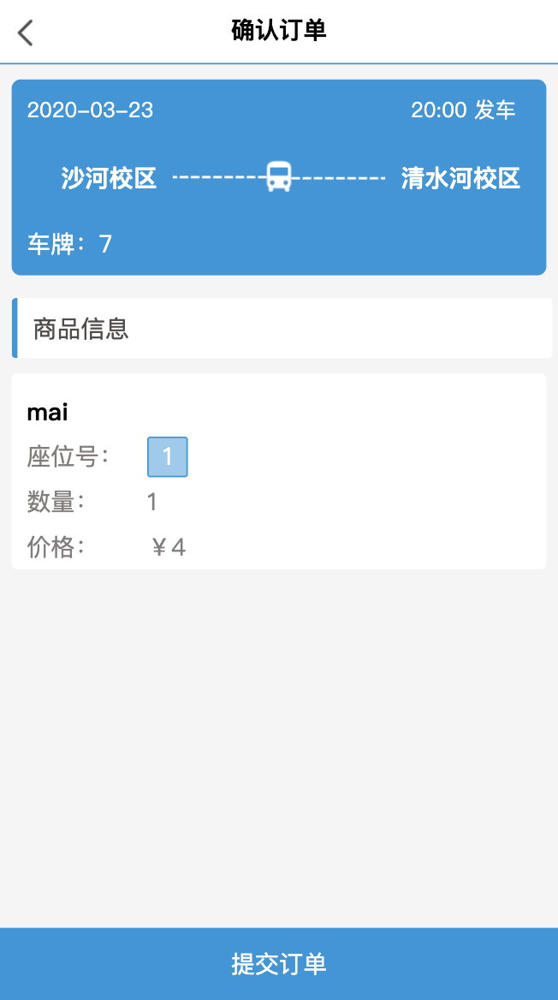

#### 订单详情


#### 支付金额

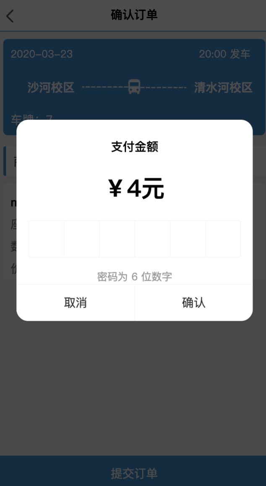

#### 未乘坐订单

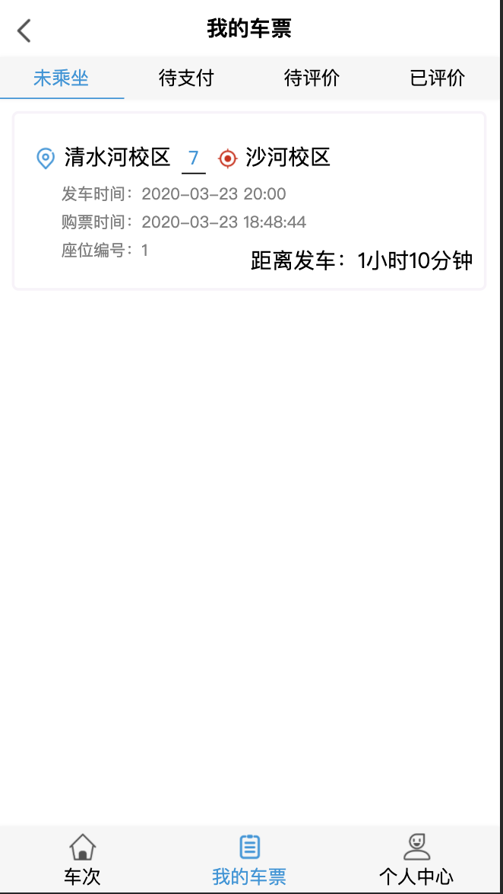

#### 待支付订单

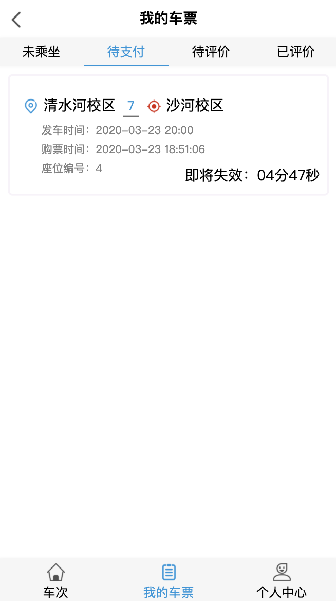

#### 已评价订单

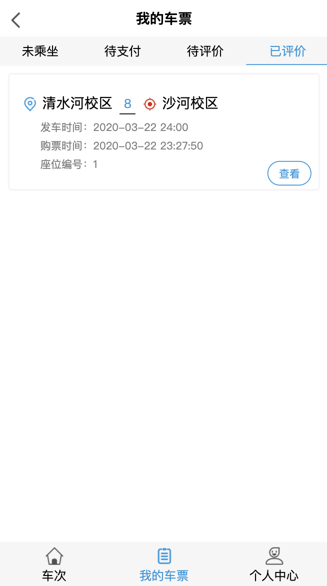

#### 待评价订单

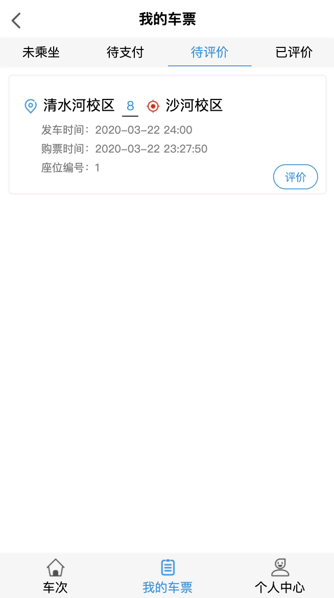

#### 申请退款

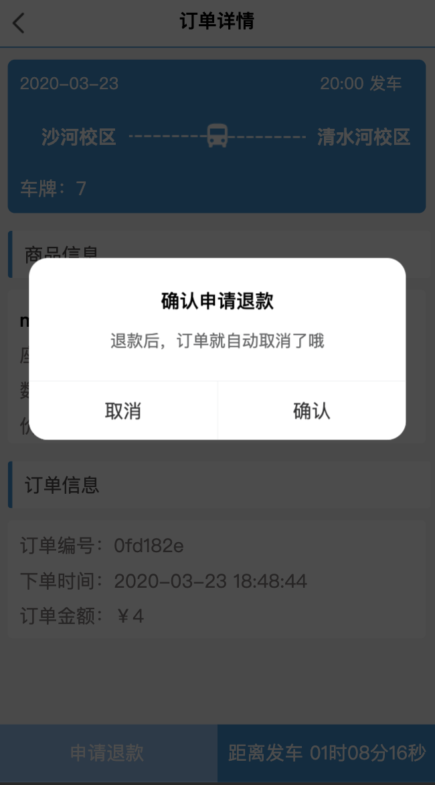

